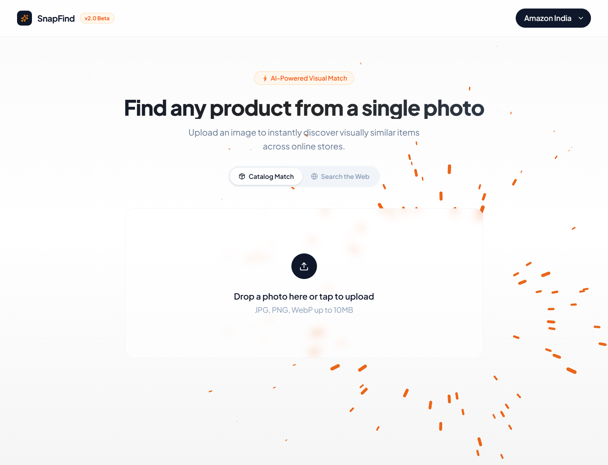
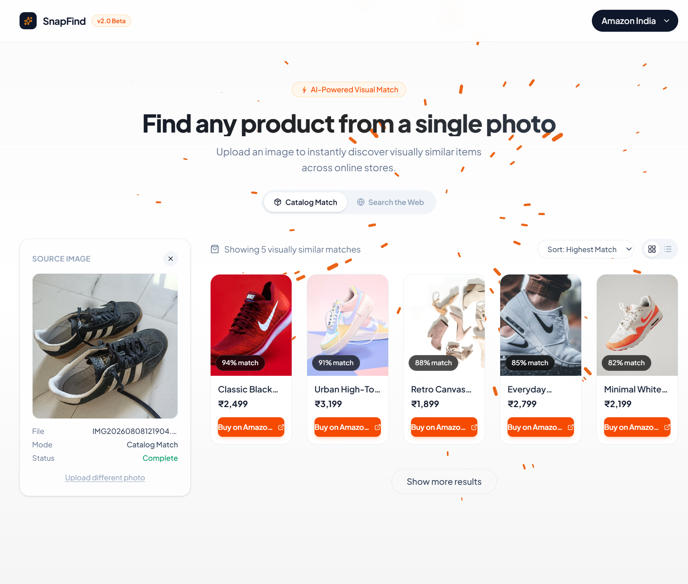

# 🔍 SnapFind (Visual Search)

<div align="center">
  
  
</div>

<div align="center">
  <p><strong>Find any product from a single photo using AI-powered visual matching.</strong></p>
  <a href="https://visualsearchfrontend.vercel.app/"><strong>Explore the Live Demo</strong></a>
</div>

<br />

## 💡 WHY: The Problem It Solves
Have you ever seen a great outfit, a stylish piece of furniture, or a gadget, but had no idea what to type into a search bar? Traditional text-based search fails when users lack the vocabulary to describe an item accurately. 

**SnapFind** solves this by letting the image do the talking. It bridges the gap between seeing something in the real world (or on social media) and finding exactly where to buy it online.

## ⚙️ HOW: How It Works
SnapFind is a Next.js-based web application that provides a seamless interface for visual commerce. 
1. **Input:** Users drag & drop or tap to upload an image (Supports JPG, PNG, WebP up to 10MB).
2. **Targeting:** Users select their preferred marketplace from a dynamic dropdown (Amazon India, Amazon US, Flipkart, eBay).
3. **Processing:** The frontend handles the image payload and interfaces with the backend visual search API.
4. **Result:** Visually similar or exact match products are rendered instantly.

## 🚀 Key Features
- **⚡ AI-Powered Visual Match:** Core interface designed to handle image recognition payloads smoothly.
- **🛍️ Multi-Platform Searching:** Contextual routing for major e-commerce platforms (Amazon, Flipkart, eBay).
- **🖼️ Drag & Drop UI:** Frictionless, accessible user experience for photo uploads.
- **📱 Fully Responsive:** Optimized for both desktop browsing and mobile "snap and search" experiences.

## 🛠️ Tech Stack
- **Framework:** Next.js / React
- **Architecture:** Component-based UI with client-side state management
- **Deployment:** Vercel (Edge network optimized)

## 💻 Getting Started (Local Development)

### Prerequisites
Make sure you have Node.js and npm (or yarn) installed on your local machine.

### Installation & Setup

1. **Clone the repository:**
   ```bash
   git clone [https://github.com/Sahil-Tamrakar/Visual_Search_Frontend.git](https://github.com/Sahil-Tamrakar/Visual_Search_Frontend.git)

```

2. **Navigate to the directory:**
```bash
cd Visual_Search_Frontend

```


3. **Install dependencies:**
```bash
npm install
# or
yarn install

```


4. **Run the development server:**
```bash
npm run dev
# or
yarn dev

```


5. Open [http://localhost:3000](http://localhost:3000?utm_source=gemini) with your browser to see the application running.

## 🎯 WHEN: Ideal Use Cases

* **Social Media Shopping:** See an item on Instagram or Pinterest? Screenshot it and find the store link.
* **Home & Decor:** Identify a specific style of a chair or lamp and find similar alternatives online.
* **Cross-Platform Comparison:** Upload a product image to quickly see if it's available on Flipkart vs. Amazon vs. eBay.

## 👨‍💻 Author

**Sahil Tamrakar**

B.Tech Computer Science | Aspiring Software Engineer
